# 【星】PDF扫描件转WORD

将AV画质的pdf转成word的道具，并尽可能保持格式不变。

## 功能

-   自动旋转矫正

-   表格识别

-   目录识别

-   文字识别

-   图片识别

## 依赖

python 3.6  
tesseract-ocr

```
pip install tqdm numpy scipy scikit-learn pdf2image pytesseract opencv-python cloudpickle
```

## 使用方法

暂时没有GUI，你可以从`hoshi_api.py`中挑选接口来调用。

主要功能: 

+ `pdf_to_word(pdf_file_name, word_file_name, brightness_threshold=166, dpi=600, thread_count=3)`  
    将pdf文件转成word。  
    可以指定亮度阈值(用于去除水印)，DPI(越高越准)，线程数(金钱就是力量)。

+ `image_to_word(image_file_name, word_file_name, brightness_threshold=166)`  
    将单张图片转成word。  
    可以指定亮度阈值(用于去除水印)。

特典(?)功能: 

+ `extract_form_image(image_file_name)`  
    从单张图片提取表格，包括位置和其图像。

+ `extract_form(image_file_name)`  
    从单张图片提取表格，返回一个表格对象，包含位置和表格内容。

+ `image_rotation_correction(image_file_name)`  
    自动旋转矫正。


## 原理

将PDF文件拆包为图片组，各页各自送入流水线进行处理，得到每一页的信息，最终组装成word文档。

在流水线中，各图片按 `旋转矫正` -> `表格提取` -> `目录提取` -> `OCR` -> `图片提取` 的顺序进行处理，各个流水线各自独立，可使用多线程。

### 旋转矫正

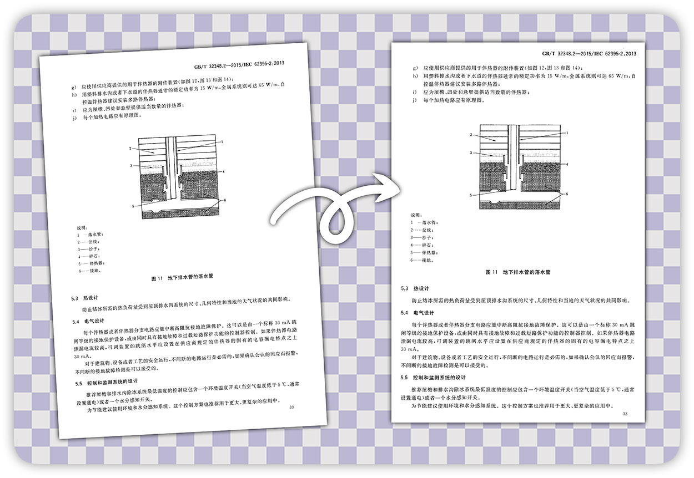

之前见过一个方法，用的是霍夫直线检测+统计。不过一方面是我觉得这个算法不太准，另一方面是对opencv的霍夫直线检测怀恨在心(???)，因此没有采用。

hoshi使用了基于轮廓检测的方法来检测旋转角度。

<p align="center">
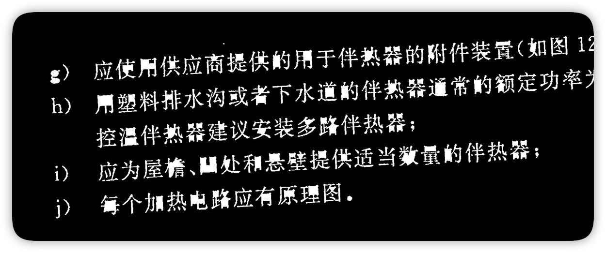
(各个文字成为独立的轮廓，有些文字可成为多个轮廓)
</p>

对整页进行最外层轮廓检测，可以得到大部分的文字轮廓。  
去除远大于平均大小的轮廓(它们很可能不是文字)。

<p align="center">
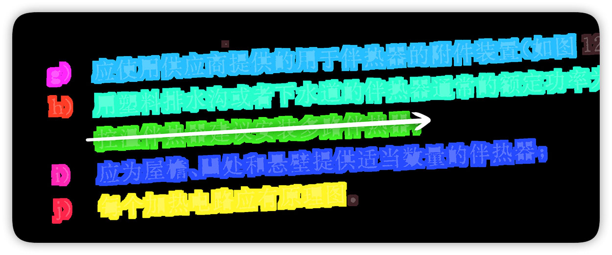
(轮廓合并后，每种颜色代表一个轮廓)
</p>

将轮廓进行循环膨胀，直到剩余轮廓数小于原本的1/4。  
此时字的轮廓之间发生重合，形成横向的大轮廓。因为字距总是小于行距，行之间仍然保持分离。
  
之后进行第二次轮廓检测，统计这些大轮廓的朝向，按轮廓长宽比和大小进行加权平均，即可得到旋转角度。

### 表格提取

如果自动旋转矫正能保证页面正直，表格提取即没有必要采用霍夫直线检测。

hoshi采用了横纵开闭运算的方法检测表格线。

<p align="center">
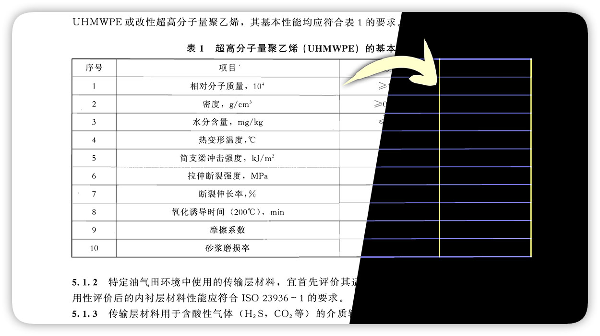
(黄线为横向提取结果，蓝线为纵向提取结果)
</p>

对含有表格的图片仅在横方向上做开运算，去除竖线和大部分的文字文字，剩余横向长线。同理可得竖向长线。  
将横竖长线按最大值合并，即可得到表格框体。

这个操作之后可能留下少量杂质，可根据面积大小将其剔除。

<p align="center">
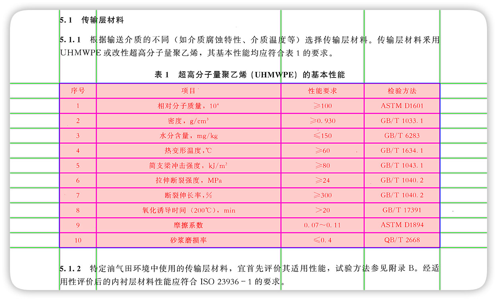
(黄线为极值线，蓝线为真实表格线)
</p>

在横竖方向上做累加投影，可以得到各个维度的能量分布。对该分布做非极大值抑制，即可得到每条表格线的座标。

对表格内部的单元格是否合并等情况，之后再进行一次检测。
在每个可能的单元格交点的周围检测是否有横线或竖线，来判断是否有合并的大单元格。

### 目录检测

OCR引擎不能直接识别出目录的形态，直接识别容易跑出乱七八糟的东西。  
因此我自己手写了一下。

目录的主要成分是省略号，因此目前的思路是检测过长的省略号(真的没问题吗)。

<p align="center">
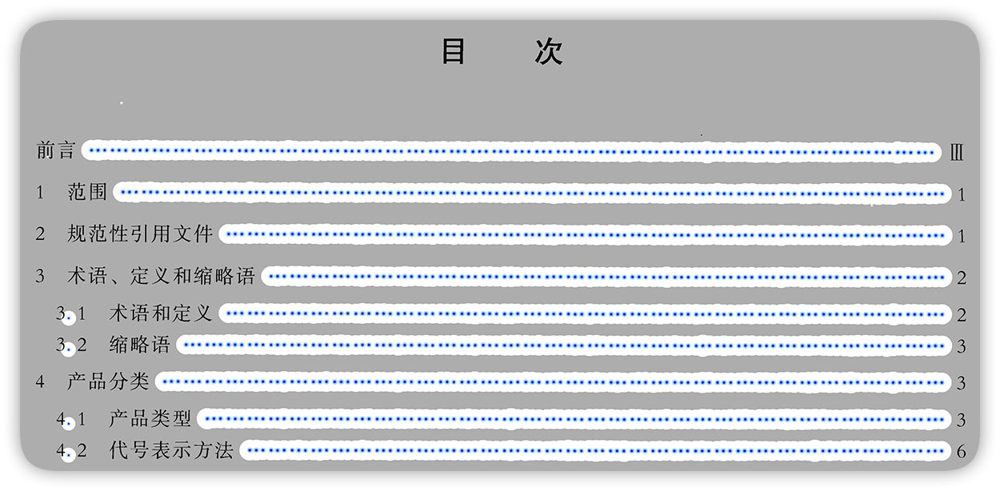
(小点被蓝色标出，膨胀区域为白色)
</p>

第一次轮廓检测，根据凸包面积比选出形状接近圆的轮廓，可以选中大部分省略号的小点。

将圆形轮廓进行膨胀。
第二次轮廓检测，检测横向的长条形轮廓，即为目录所在行。

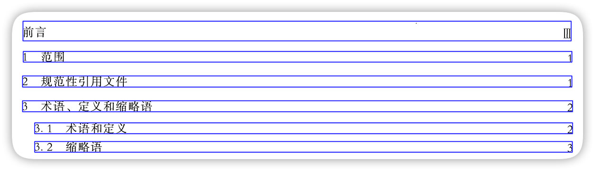

将省略号的轮廓去除，重新进行OCR后，进行组装。

### 文字检测

文字检测可以调用tesseract(本地)或百度(在线)接口，取决于调用时传递的OCR引擎类型。

<p align="center">
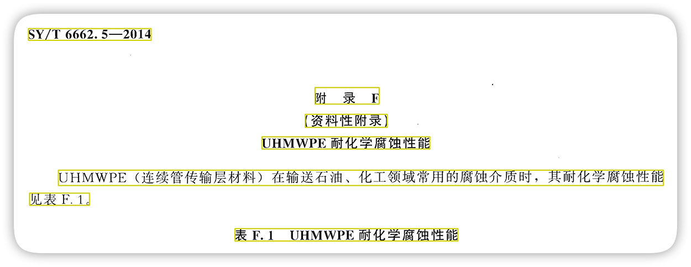
(不是我写的，识别不准我能怎么办……)
</p>

在得到对应的行信息后，为了组成段落和文档，将行距进行K-means聚类(其实大津算法就够了)，将得到的数值较小的类别当作段内行间间距，较大的类别当作段间间距，即可将其分割成数个段落。  
之后在段内，根据上行和下行的位置关系等，尽可能上下地并为一个无换行的行。

### 图片分割

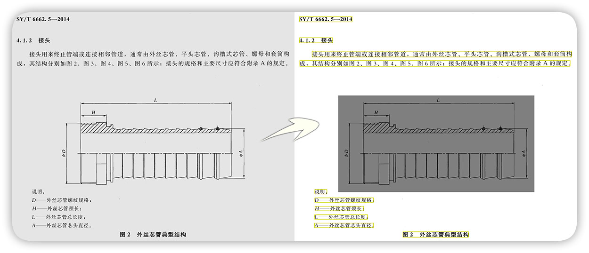

pdf中的图片千奇百怪，很难有合适的方法分离出来，因此采用了在提取文字之后将剩余部分视作图片的做法。

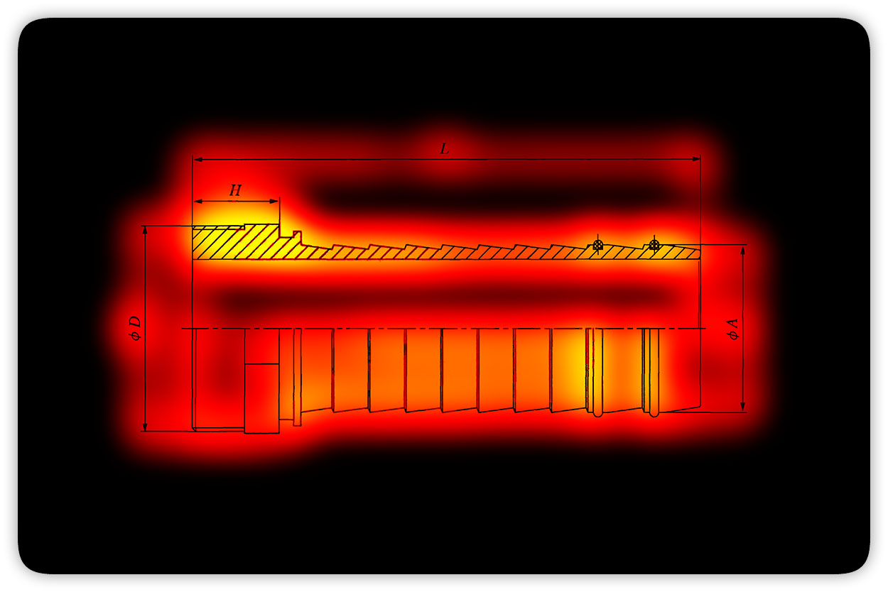

将剩余区域进行模糊处理，得到其能量分布。这个操作一方面可以去除散点，另一方面也使有较小间隙的图像部分之间合并为一张完整的图片。

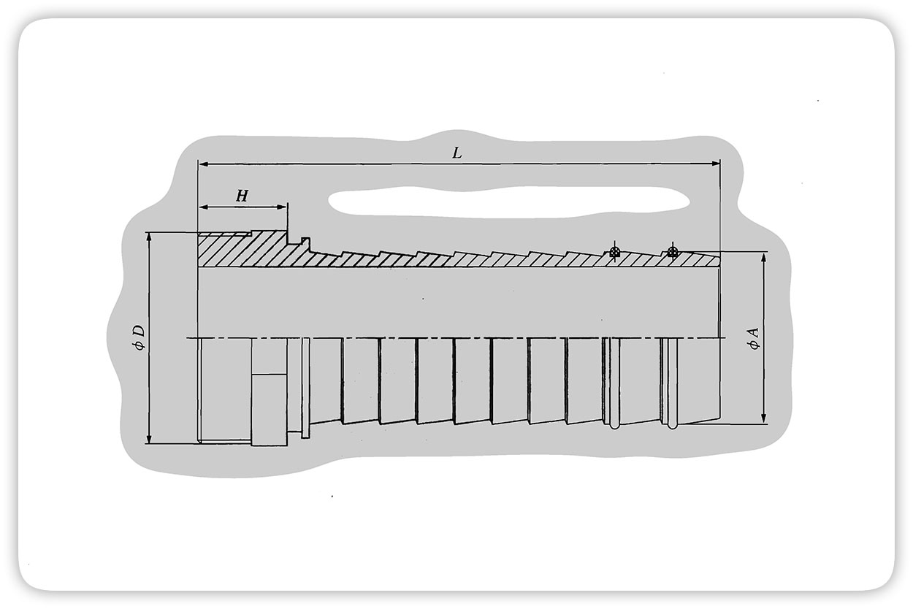

对能量图进行二值化，并进行轮廓检测，得到每个检测到的区域矩形外框，逐个截取即可得到对应图片。

## 赞助

如果你觉得「星」对你的工作或学习有帮助，欢迎给作者介绍一些萝〇女朋友。

> 因为我是不挑食的好孩子，所以凡是萝〇都OK。
