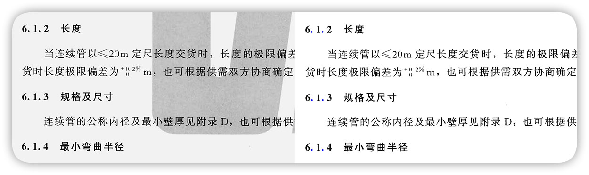

# 【星】PDF扫描件转WORD

将AV画质的pdf转成word的道具，并尽可能保持格式不变。


## 功能

-   自动旋转矫正

-   表格识别

-   目录识别

-   文字识别

-   图片识别


## 使用方法

可以从`hoshi_api.py`中挑选接口来调用。  
GUI还在开发中，虽然我的前端水平很糟糕……

主要功能: 

+ `pdf_to_word(pdf_file_name, word_file_name, brightness_threshold=166, dpi=600, thread_count=3)`  
    将pdf文件转成docx。  
    可以指定亮度阈值(用于去除水印)，解包DPI(越高越准)，线程数(金钱就是力量)。
    
+ `image_to_word(image_file_name, word_file_name, brightness_threshold=166, dpi=600)`  
    将单张图片转成docx。  
    可以指定亮度阈值(用于去除水印)，DPI(用于计算文档实际尺寸)。

特典(?)功能: 

+ `extract_form_image(image_file_name)`  
    从单张图片提取表格，包括位置和其图像。

+ `extract_form(image_file_name)`  
    从单张图片提取表格，返回一个表格对象，包含位置和表格内容。

+ `image_rotation_correction(image_file_name)`  
    自动旋转矫正，返回矫正后的图片。


## 原理

将PDF文件拆包为图片组，各页各自送入流水线进行处理，得到每一页的信息，最终组装成word文档。

在流水线中，各图片按 `旋转矫正` -> `表格提取` -> `目录提取` -> `OCR` -> `图片提取` 的顺序进行处理，各个流水线各自独立，也提供多线程支持。

### 预处理

为了让接下来的步骤能正常工作，先对文档进行一次全局二值化和局部二值化。

全局二值化的目的是保证扫描件的背景颜色为白色(255)，并去除水印。在这个步骤只将高于阈值的部分调整为白色。  
这个阈值暂时不能自动检测，需要根据文档的水印强度手动决定，当然原本没有水印就最好了。



局部二值化根据每个局部的高斯窗口将图像分为黑白两部分。只将低于高斯平均值一定水平的点设为黑色，其他设为白色。  
用于减少不规则的大面积黑色对算法的干扰。

局部二值化只用于算法内确定信息，最终如果需要输出图像则会从前一步截取。

### 旋转矫正


之前见过一个方法，用的是霍夫直线检测+统计。不过一方面是我觉得这个算法不太准，另一方面是对opencv的霍夫直线检测怀恨在心(???)，因此没有采用。

hoshi使用了基于轮廓检测的方法来检测旋转角度。

<p align="center">

(各个文字成为独立的轮廓，有些文字可成为多个轮廓)
</p>

对整页进行最外层轮廓检测，可以得到大部分的文字轮廓。  
去除远大于平均大小的轮廓(它们很可能不是文字)。

<p align="center">

(轮廓合并后，每种颜色代表一个轮廓)
</p>

将轮廓进行循环膨胀，直到剩余轮廓数小于原本的1/4。  
此时字的轮廓之间发生重合，形成横向的大轮廓。因为字距总是小于行距，行之间仍然保持分离。
  
之后进行第二次轮廓检测，统计这些大轮廓的朝向，按轮廓长宽比和大小进行加权平均，即可得到旋转角度。

最后，反向进行仿射变换得到正直图片。

### 表格提取

自动旋转矫正能保证页面正直，因此表格提取没有必要采用霍夫直线检测。

hoshi采用了横纵开闭运算的方法检测表格线。

<p align="center">

(黄线为横向提取结果，蓝线为纵向提取结果)
</p>

对含有表格的图片仅在横方向上做开运算，去除竖线和大部分的文字文字，剩余横向长线。同理可得竖向长线。  
将横竖长线按最大值合并，即可得到表格框体。

如果文档中本身有长线，开运算后仍可能留下少量杂质。  
此时再进行一次最外围轮廓检测，可划定面积阈值将其剔除。

<p align="center">

(黄线为极值线，蓝线为真实表格线)
</p>

在横竖方向上做累加投影，可以得到各个维度的能量分布。对该分布做非极大值抑制，即可得到每条表格线的座标。

对表格内部的单元格是否合并等情况，之后再进行一次检测。
在每个可能的单元格交点的周围检测是否有横线或竖线，来判断是否有合并的大单元格。

最后，对所有的单元格进行OCR，将OCR结果填入对应的单元格。

### 目录检测

OCR引擎不能直接识别出目录的形态，直接识别容易跑出乱七八糟的东西。  
因此我自己手写了一下。

目录的主要成分是省略号，因此目前的思路是检测过长的省略号(真的没问题吗)。

<p align="center">

(小点被蓝色标出，膨胀区域为白色)
</p>

第一次轮廓检测，根据凸包面积比选出形状接近圆的轮廓，可以选中大部分省略号的小点。

将圆形轮廓进行膨胀。
第二次轮廓检测，检测横向的长条形轮廓，即为目录所在行。


将省略号的轮廓去除，重新进行OCR后，进行组装，得到每个目录行。

### 文字检测

文字检测可以调用tesseract(本地)或百度(在线)接口，取决于调用时传递的OCR引擎类型。

<p align="center">

(不是我写的，识别不准我能怎么办……)
</p>

虽然我尽可能做了适配，但是两个引擎各有各的偏见，并不能无缝切换。

之前大体上是以tesseract的OCR为基础做的，说实话我对这个引擎的正确率不满意，无论在字的定位还是字的识别上，都有明显的漏检误检。用百度的接口就好很多(当然要收钱)。  
我想，接下来干脆全部换成百度的接口算了，虽然一页大概4分钱左右，不过能把校对的钱省下来就不亏吧……

在得到对应的行信息后，为了组成段落和文档，将行距进行K-means聚类(其实大津算法就够了)，将得到的数值较小的类别当作段内行间间距，较大的类别当作段间间距，即可将其分割成数个段落。  
之后在段内，根据上行和下行的位置关系等，尽可能上下地并为一个无换行的行。

### 图片分割


PDF中的图片千奇百怪，很难有合适的方法分离出来。因此采用了在提取文字之后将剩余部分视作图片的做法。


将剩余区域进行模糊处理，得到其能量分布。  
这个操作一方面可以去除散点，另一方面也使有较小间隙的图像部分之间合并为一张完整的图片。


对能量图进行二值化，并进行最外层轮廓检测。  
每个检测到的轮廓都视为一张独立的图片。

最后，取轮廓矩形外框，按该范围截取，得到对应图片。

## 依赖

python 3.6  
tesseract-ocr

```
pip install tqdm numpy scipy scikit-learn pdf2image pytesseract opencv-python python-docx
```

## 赞助

如果你觉得「星」对你的工作或学习有帮助，欢迎给作者介绍一些萝〇女朋友。

> 因为我是不挑食的好孩子，所以凡是萝〇都OK。

## 后记

### 后记的前言

总感觉这次的PDF识别会变成一个大工程……

虽然之前做过一些图形学的算法，不过单挑图形学的工程还是第一次。总的来说完成度还算可以吧——比我想象得要低一些，可能是小学期游戏打得有点多(天怒真好玩)。

### 一点感想

一开始觉得应该有不少库能调用，不过实际展开了之后发现用得最多的还是opencv。别人在PDF识别上能派上一点用场的东西倒也不是没有，但是一方面并非所有软件都是开源的，另一方面开源软件的质量也是参差不齐。于是要用的时候就变成了「这个不行，那个也不行」的状态，最后大部分功能是在opencv上自己动手做了。

说到这里，好像很多人是不愿意这样干的，说是自己造轮子完全是浪费时间。我倒是不这么觉得——就拿现实的轮子来说，人类从远古时代就在战车上使用轮子。之后轮子技术日益进步，现代的轮子已经远超远古时期的轮子，这归功于一代又一代研究轮子尝试发明新轮子的人。

不过，我有时也这样苛责自己「有人用你造的轮子吗？你的轮子凭什么比别人的好？」——当然比别人的好。好坏作为主观评价的内容，只要有一个人觉得这是最好的轮子，它就有存在的意义。反过来，Github上也有星数很高，但用了之后自己却感觉「这是什么垃圾」可能不怎么样或者是没法体会到它好处的东西。当然我自己也常丢一些意义不明的垃圾上去，我说不定注意到这是一种乐趣了。

乐观地想的话，就算一个人的轮子做得很差，但其中包含了那个作者的想法，也许有一天后人看到了从那个想法中得到启发，造出不得了的东西，那也算是为科学作了贡献吧。

### 后记的结束

好像这个心得体会和项目的关系不是很大……没关系，能从一件事情本身发散到各种道理才好。
